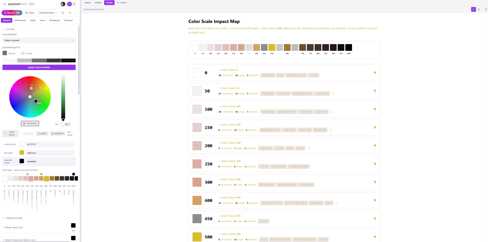

<p align="center">
  
</p>

<h1 align="center">payloadtwist</h1>

<p align="center">
  A visual CSS theme editor for the <a href="https://payloadcms.com">Payload CMS</a> admin panel.<br/>
  Tweak colors, typography, spacing, and components with real-time preview — then export clean CSS.
</p>

<p align="center">
  
</p>

## Features

- **Color scale generator** — color wheel, lightness slider, and palette presets to retheme the entire admin panel
- **Color scale impact map** — see exactly which components each `--color-base-*` variable affects
- **Theme colors** — light and dark mode pickers for semantic variables (`--theme-bg`, `--theme-text`, etc.)
- **Status colors** — customize success, warning, and error palettes
- **Typography** — Google Fonts integration with live preview
- **Component editor** — tabbed interface for UI elements, fields, views, overlays, and dashboard components
- **Roundness control** — single slider deriving small, medium, and large border radii
- **BEM raw CSS editor** — drop in custom CSS for any Payload BEM block
- **Live preview** — sandboxed iframe with real Payload UI components (no CMS instance required)
- **Custom preview** — connect your own running Payload instance for live CSS injection
- **Undo/redo** — full history for every change
- **Export** — generates a clean `custom.scss` snippet ready to paste into your Payload project

## Quick start

```bash
# Clone and install
git clone https://github.com/your-org/payloadtwist.git
cd payloadtwist
pnpm install

# Set up environment
cp apps/web/.env.example apps/web/.env
# Edit apps/web/.env with your database URL

# Start development
pnpm dev
```

Open [http://localhost:3000](http://localhost:3000) to see the landing page. Navigate to `/editor` to start theming.

## Project structure

```
payloadtwist/
├── apps/
│   └── web/                  ← Next.js app (editor, dashboard, auth, preview)
├── packages/
│   └── ui-sandbox/           ← Payload UI component sandbox for live preview
├── turbo.json
├── pnpm-workspace.yaml
└── package.json
```

## Tech stack

- **Framework** — Next.js 15 (App Router)
- **Monorepo** — Turborepo + pnpm workspaces
- **State** — Zustand with undo/redo middleware
- **Auth** — Better Auth (PostgreSQL via Drizzle)
- **Preview** — `@payloadcms/ui` components rendered via mock providers (no CMS runtime)
- **Styling** — Tailwind CSS (editor chrome) + Payload CSS variables (preview)

## Development

```bash
pnpm dev            # Start all packages
pnpm build          # Build all packages
pnpm lint           # Lint all packages
pnpm typecheck      # Typecheck all packages
```

### Docker

```bash
docker-compose up
```

Spins up the app and a PostgreSQL database for auth.

## How it works

The editor manipulates Payload's three-layer CSS variable system:

1. **Base color scale** (`--color-base-0` through `--color-base-1000`) — the primary theming lever
2. **Elevation aliases** (`--theme-elevation-*`) — auto-inverted by Payload in dark mode, never overridden directly
3. **Semantic theme vars** (`--theme-bg`, `--theme-text`, etc.) — support explicit light/dark overrides

Changes are injected into a sandboxed iframe via `<style>` tags. The preview renders real `@payloadcms/ui` components through mock providers, so what you see is what you get.

## License

MIT
